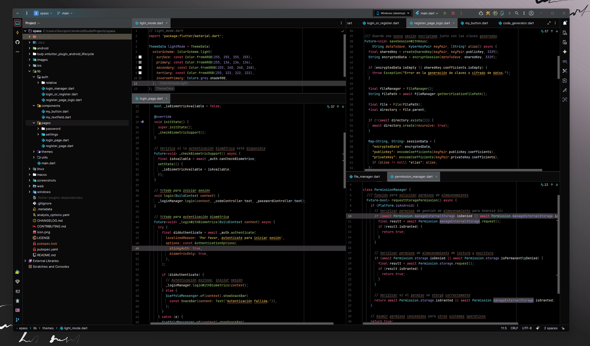
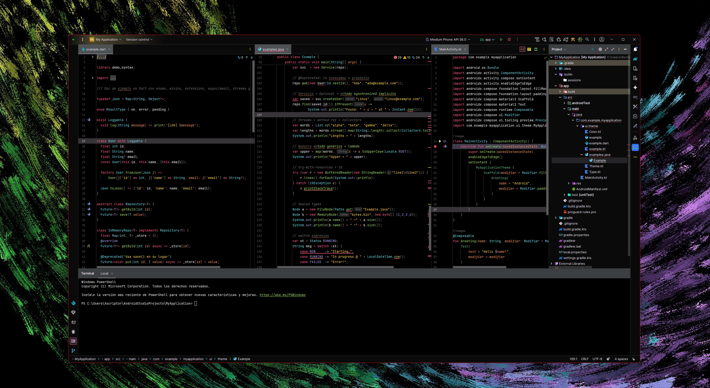

# Xscriptor Theme

A modern dark theme for Android Studio and IntelliJ IDEA featuring a carefully crafted color palette with vibrant accents and optimal contrast for enhanced coding experience.

## Preview





- Notice: the screenshots use the [Atom Material Icons theme](https://github.com/AtomMaterialUI/a-file-icon-idea).  
  Icons shown in the screenshots are not bundled with this plugin and belong to their respective authors.


## Color Palette

The theme is built around a sophisticated dark color scheme:

- **Background**: Deep black with subtle variations
- **Accent**: Vibrant pink (#fc618d) for highlights and focus elements
- **Secondary Accent**: Bright cyan (#5ad4e6) for complementary elements
- **Success**: Fresh green (#7bd88f) for positive states
- **Warning**: Warm orange (#fd9353) for attention
- **Info**: Soft purple (#948ae3) for informational elements

## Installation

### Option 1: Manual Installation
1. Download the theme files
2. Copy to your IDE's plugins directory
3. Restart your IDE
4. Go to Settings → Appearance & Behavior → Appearance → Theme
5. Select "Xscriptor Theme"

### Option 2: Build from Source
```bash
./gradlew buildPlugin
```

## Features

- Complete UI theme with consistent dark design
- Optimized syntax highlighting for multiple languages
- Enhanced readability with carefully selected contrast ratios
- Support for Java, Kotlin, XML, JSON, CSS, and more
- Modern, minimalist interface design

## Compatibility

- IntelliJ IDEA
- PyCharm
- WebStorm
- PhpStorm
- RubyMine
- CLion
- GoLand
- DataGrip
- Rider
- AppCode
- Android Studio

## License

[MIT License](./LICENSE)

## Contributing

Contributions are welcome! Please feel free to submit issues and pull requests.